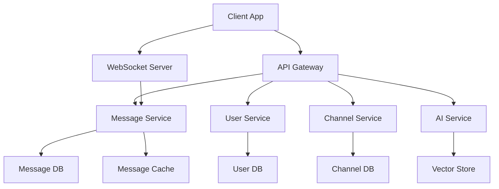

# ChatSphere Documentation Strategy

This document outlines our comprehensive approach to documentation and knowledge sharing for the ChatSphere platform.

## Documentation Structure

### 1. API Documentation

```python
# docs/api/openapi.yaml
openapi: 3.0.0
info:
  title: ChatSphere API
  version: 1.0.0
  description: |
    The ChatSphere API provides a comprehensive set of endpoints for building
    real-time chat applications with advanced features like message threading,
    reactions, and AI-powered interactions.

paths:
  /messages:
    post:
      summary: Send a message
      description: Send a new message to a channel or thread
      requestBody:
        required: true
        content:
          application/json:
            schema:
              type: object
              properties:
                content:
                  type: string
                  description: Message content
                channel_id:
                  type: string
                  description: Target channel ID
                thread_id:
                  type: string
                  description: Optional thread ID for replies
                attachments:
                  type: array
                  items:
                    type: object
                    properties:
                      type:
                        type: string
                        enum: [image, file, link]
                      url:
                        type: string
      responses:
        '201':
          description: Message created successfully
          content:
            application/json:
              schema:
                $ref: '#/components/schemas/Message'
        '400':
          description: Invalid request
        '401':
          description: Unauthorized
        '403':
          description: Forbidden

  /channels/{channelId}/messages:
    get:
      summary: Get channel messages
      parameters:
        - name: channelId
          in: path
          required: true
          schema:
            type: string
        - name: limit
          in: query
          schema:
            type: integer
            default: 50
        - name: before
          in: query
          schema:
            type: string
            format: date-time
      responses:
        '200':
          description: List of messages
          content:
            application/json:
              schema:
                type: array
                items:
                  $ref: '#/components/schemas/Message'

components:
  schemas:
    Message:
      type: object
      properties:
        id:
          type: string
        content:
          type: string
        user_id:
          type: string
        channel_id:
          type: string
        thread_id:
          type: string
        created_at:
          type: string
          format: date-time
        attachments:
          type: array
          items:
            $ref: '#/components/schemas/Attachment'
        reactions:
          type: array
          items:
            $ref: '#/components/schemas/Reaction'

    Attachment:
      type: object
      properties:
        id:
          type: string
        type:
          type: string
          enum: [image, file, link]
        url:
          type: string
        metadata:
          type: object

    Reaction:
      type: object
      properties:
        emoji:
          type: string
        count:
          type: integer
        users:
          type: array
          items:
            type: string
```

### 2. Component Documentation

```typescript
// docs/components/MessageComponent.md
# Message Component

The Message component displays a single chat message with support for rich content,
reactions, and threading.

## Usage

```tsx
import { Message } from '@chatsphere/components';

function ChatView() {
  return (
    <Message
      content="Hello, world!"
      user={currentUser}
      timestamp={new Date()}
      reactions={[
        { emoji: '👍', count: 2, users: ['user1', 'user2'] }
      ]}
      onReactionClick={handleReaction}
      onReplyClick={handleReply}
    />
  );
}
```

## Props

| Name | Type | Description |
|------|------|-------------|
| content | string | Message content |
| user | User | Message author |
| timestamp | Date | Message timestamp |
| reactions | Reaction[] | Message reactions |
| attachments | Attachment[] | Message attachments |
| isThreaded | boolean | Whether message is part of a thread |
| threadCount | number | Number of replies in thread |
| onReactionClick | (emoji: string) => void | Reaction click handler |
| onReplyClick | () => void | Reply button click handler |

## Styling

The component uses CSS modules for styling. Override styles by targeting these classes:

```scss
.message {
  // Message container
}

.message-content {
  // Message text
}

.message-metadata {
  // User info and timestamp
}

.message-actions {
  // Reaction and reply buttons
}

.message-reactions {
  // Reaction display
}
```

## Examples

### Basic Message

```tsx
<Message
  content="Simple text message"
  user={user}
  timestamp={new Date()}
/>
```

### Rich Content Message

```tsx
<Message
  content="Check out this link!"
  user={user}
  timestamp={new Date()}
  attachments={[
    {
      type: 'link',
      url: 'https://example.com',
      metadata: {
        title: 'Example Site',
        description: 'An example website'
      }
    }
  ]}
/>
```

### Threaded Message

```tsx
<Message
  content="Start of thread"
  user={user}
  timestamp={new Date()}
  isThreaded={true}
  threadCount={5}
  onReplyClick={() => setThreadVisible(true)}
/>
```
```

### 3. Architecture Documentation

```markdown
# System Architecture

## Overview

ChatSphere is built using a microservices architecture with the following key components:



## Services

### Message Service

Handles message creation, retrieval, and real-time updates.

- **Technology**: Python/FastAPI
- **Database**: PostgreSQL
- **Cache**: Redis
- **Key Features**:
  - Message CRUD operations
  - Real-time message delivery
  - Message search
  - Thread management

### User Service

Manages user accounts, authentication, and profiles.

- **Technology**: Python/FastAPI
- **Database**: PostgreSQL
- **Key Features**:
  - User authentication
  - Profile management
  - Permission control
  - Session management

### Channel Service

Handles channel creation and management.

- **Technology**: Python/FastAPI
- **Database**: PostgreSQL
- **Key Features**:
  - Channel CRUD operations
  - Member management
  - Channel settings
  - Access control

### AI Service

Provides AI-powered features like smart responses and content analysis.

- **Technology**: Python/FastAPI
- **Database**: Pinecone (Vector Store)
- **Key Features**:
  - Smart replies
  - Content summarization
  - Sentiment analysis
  - Topic modeling

## Data Flow

1. **Message Creation**:
   ```mermaid
   sequenceDiagram
       Client->>API Gateway: POST /messages
       API Gateway->>Message Service: Create Message
       Message Service->>Message DB: Store Message
       Message Service->>Message Cache: Cache Message
       Message Service->>WebSocket: Broadcast Update
       WebSocket->>Client: Real-time Update
   ```

2. **Message Retrieval**:
   ```mermaid
   sequenceDiagram
       Client->>API Gateway: GET /channels/{id}/messages
       API Gateway->>Message Service: Get Messages
       Message Service->>Message Cache: Check Cache
       Message Cache-->>Message Service: Cache Miss
       Message Service->>Message DB: Fetch Messages
       Message Service->>Message Cache: Update Cache
       Message Service->>API Gateway: Return Messages
       API Gateway->>Client: Messages Response
   ```
```

### 4. User Documentation

```markdown
# ChatSphere User Guide

## Getting Started

### 1. Account Creation

1. Visit [chatsphere.com/signup](https://chatsphere.com/signup)
2. Enter your email and password
3. Verify your email address
4. Complete your profile

### 2. Workspace Setup

1. Create a new workspace:
   - Click "Create Workspace"
   - Enter workspace name
   - Invite team members

2. Configure workspace settings:
   - Set workspace icon
   - Configure permissions
   - Set up integrations

### 3. Channel Management

1. Create channels:
   ```
   /create-channel channel-name
   ```

2. Invite members:
   ```
   /invite @username
   ```

3. Set channel topic:
   ```
   /topic This channel is for project discussions
   ```

## Features

### 1. Messaging

- **Rich Text**: Use markdown for formatting
  ```
  **bold**
  *italic*
  `code`
  ```

- **File Sharing**: Drag & drop files
- **Code Snippets**:
  ````
  ```python
  def hello():
      print("Hello, world!")
  ```
  ````

### 2. Threading

- Start a thread by clicking the "Start Thread" button
- Reply in thread to keep discussions organized
- Follow/unfollow threads for notifications

### 3. AI Features

- **Smart Replies**: Click the AI button for suggested responses
- **Message Summary**: Use `/summarize` in a channel
- **Code Review**: Use `/review` on code snippets

## Keyboard Shortcuts

| Action | Windows/Linux | macOS |
|--------|--------------|-------|
| New Message | Ctrl + N | ⌘ + N |
| Search | Ctrl + K | ⌘ + K |
| Quick Switcher | Ctrl + T | ⌘ + T |
| Format Bold | Ctrl + B | ⌘ + B |
| Format Italic | Ctrl + I | ⌘ + I |
| Format Code | Ctrl + E | ⌘ + E |

## Troubleshooting

### Common Issues

1. **Can't Send Messages**
   - Check your internet connection
   - Verify channel permissions
   - Clear browser cache

2. **Notifications Not Working**
   - Check browser permissions
   - Verify notification settings
   - Update your browser

3. **Performance Issues**
   - Clear application cache
   - Update to latest version
   - Check system resources
```

### 5. Developer Guide

```markdown
# Developer Guide

## Setup Development Environment

### 1. Prerequisites

- Python 3.10+
- Node.js 18+
- PostgreSQL 13+
- Redis 6+

### 2. Installation

1. Clone repository:
   ```bash
   git clone https://github.com/chatsphere/chatsphere.git
   cd chatsphere
   ```

2. Set up backend:
   ```bash
   cd backend
   python -m venv venv
   source venv/bin/activate  # or `venv\Scripts\activate` on Windows
   pip install -r requirements/dev.txt
   ```

3. Set up frontend:
   ```bash
   cd frontend
   npm install
   ```

4. Configure environment:
   ```bash
   cp .env.example .env
   # Edit .env with your settings
   ```

### 3. Development Workflow

1. Start backend server:
   ```bash
   uvicorn main:app --reload
   ```

2. Start frontend development server:
   ```bash
   npm run dev
   ```

3. Run tests:
   ```bash
   # Backend tests
   pytest

   # Frontend tests
   npm test
   ```

## Architecture Overview

### 1. Backend Structure

```
backend/
├── api/              # API endpoints
├── core/             # Core functionality
├── models/           # Database models
├── services/         # Business logic
├── schemas/          # Pydantic schemas
└── utils/            # Utility functions
```

### 2. Frontend Structure

```
frontend/
├── components/       # React components
├── hooks/           # Custom hooks
├── pages/           # Page components
├── services/        # API services
├── store/           # State management
└── utils/           # Utility functions
```

## Contributing

### 1. Code Style

- Follow PEP 8 for Python code
- Use ESLint and Prettier for TypeScript/React
- Write meaningful commit messages
- Include tests for new features

### 2. Pull Request Process

1. Create feature branch:
   ```bash
   git checkout -b feature/your-feature
   ```

2. Make changes and commit:
   ```bash
   git add .
   git commit -m "feat: add new feature"
   ```

3. Push changes:
   ```bash
   git push origin feature/your-feature
   ```

4. Create pull request:
   - Use PR template
   - Add description
   - Link related issues

### 3. Testing Guidelines

1. Unit Tests:
   ```python
   def test_feature():
       # Arrange
       data = setup_test_data()
       
       # Act
       result = feature_function(data)
       
       # Assert
       assert result == expected_result
   ```

2. Integration Tests:
   ```python
   async def test_api_endpoint():
       # Setup
       client = TestClient(app)
       
       # Test
       response = client.post("/api/endpoint", json=data)
       
       # Verify
       assert response.status_code == 200
       assert response.json() == expected_response
   ```

## Deployment

### 1. Production Setup

1. Build frontend:
   ```bash
   npm run build
   ```

2. Configure environment:
   ```bash
   export DATABASE_URL="postgresql://..."
   export REDIS_URL="redis://..."
   export SECRET_KEY="your-secret-key"
   ```

3. Run migrations:
   ```bash
   alembic upgrade head
   ```

4. Start application:
   ```bash
   gunicorn main:app -w 4 -k uvicorn.workers.UvicornWorker
   ```

### 2. Monitoring

1. Set up logging:
   ```python
   import logging
   
   logging.basicConfig(
       level=logging.INFO,
       format='%(asctime)s - %(name)s - %(levelname)s - %(message)s'
   )
   ```

2. Configure metrics:
   ```python
   from prometheus_client import Counter, Histogram
   
   request_count = Counter('http_requests_total', 'Total HTTP requests')
   request_latency = Histogram('http_request_duration_seconds', 'HTTP request duration')
   ```

## Security

### 1. Authentication

```python
from fastapi import Depends, HTTPException
from fastapi.security import OAuth2PasswordBearer

oauth2_scheme = OAuth2PasswordBearer(tokenUrl="token")

async def get_current_user(token: str = Depends(oauth2_scheme)):
    user = await verify_token(token)
    if not user:
        raise HTTPException(status_code=401)
    return user
```

### 2. Authorization

```python
from enum import Enum
from typing import List

class Permission(Enum):
    READ = "read"
    WRITE = "write"
    ADMIN = "admin"

def check_permissions(user: User, required: List[Permission]):
    if not all(p in user.permissions for p in required):
        raise HTTPException(status_code=403)
```
```

## Next Steps

For details on how we'll handle project maintenance and updates, refer to the [Maintenance Strategy](./14-maintenance-strategy.md) document.

### 6. Knowledge Transfer & Troubleshooting

#### Common Pitfalls & Solutions

1. WebSocket Connection Issues
   - Problem: Connection drops and reconnection handling
   - Solution: Implement robust reconnection logic with exponential backoff
   - Monitoring: Track connection status and failed reconnection attempts

2. Database Connection Pool Issues
   - Problem: Pool exhaustion and connection leaks
   - Solution: Implement connection pooling with proper timeout settings
   - Monitoring: Track active connections and pool utilization

3. State Management Challenges
   - Problem: Race conditions in real-time updates
   - Solution: Implement optimistic updates with proper error handling
   - Monitoring: Track state conflicts and resolution success rate

#### Architecture Decision Records (ADRs)

1. Message Queue Selection (ADR-001)
   - Decision: Use RabbitMQ for message queuing
   - Rationale: Mature solution with good Python/Node.js support
   - Impact: Improved reliability for real-time features

2. State Management Strategy (ADR-002)
   - Decision: Use Pinia for Vue.js state management
   - Rationale: Better TypeScript support and composition API
   - Impact: More maintainable and type-safe state management

### 7. Version Control & Release Management

#### Branching Strategy

- Main Branch: Protected, requires PR review
- Development Branch: Integration branch for features
- Feature Branches: Individual feature development
- Release Branches: Version preparation
- Hotfix Branches: Production bug fixes

#### Commit Message Format

```
<type>(<scope>): <description>

[optional body]

[optional footer]
```

Types:
- feat: New feature
- fix: Bug fix
- docs: Documentation
- test: Testing
- refactor: Code refactoring
- style: Code style updates
- chore: Maintenance tasks

#### Changelog Management

- CHANGELOG.md in repository root
- Semantic versioning (MAJOR.MINOR.PATCH)
- Categorized changes (Added, Changed, Deprecated, Removed, Fixed)
- Release notes for each version

### 8. Cross-References & External Resources

#### Internal Cross-References

- [Frontend Implementation](./07-frontend-implementation.md)
  - Component documentation
  - State management
  - UI/UX guidelines

- [Backend Implementation](./08-backend-implementation.md)
  - API endpoints
  - Database schema
  - Service architecture

- [Testing Strategy](./12-testing-strategy.md)
  - Test coverage requirements
  - Performance benchmarks
  - CI/CD integration

#### External Resources

Documentation:
- Vue.js: https://vuejs.org/guide/introduction.html
- Django REST Framework: https://www.django-rest-framework.org/
- WebSocket Protocol: https://datatracker.ietf.org/doc/html/rfc6455

Best Practices:
- 12 Factor App: https://12factor.net/
- OWASP Security Guidelines: https://owasp.org/www-project-web-security-testing-guide/
- Google API Design Guide: https://cloud.google.com/apis/design

## Next Steps

For details on how we'll maintain and update the platform over time, refer to the [Maintenance Strategy](./14-maintenance-strategy.md) document. 