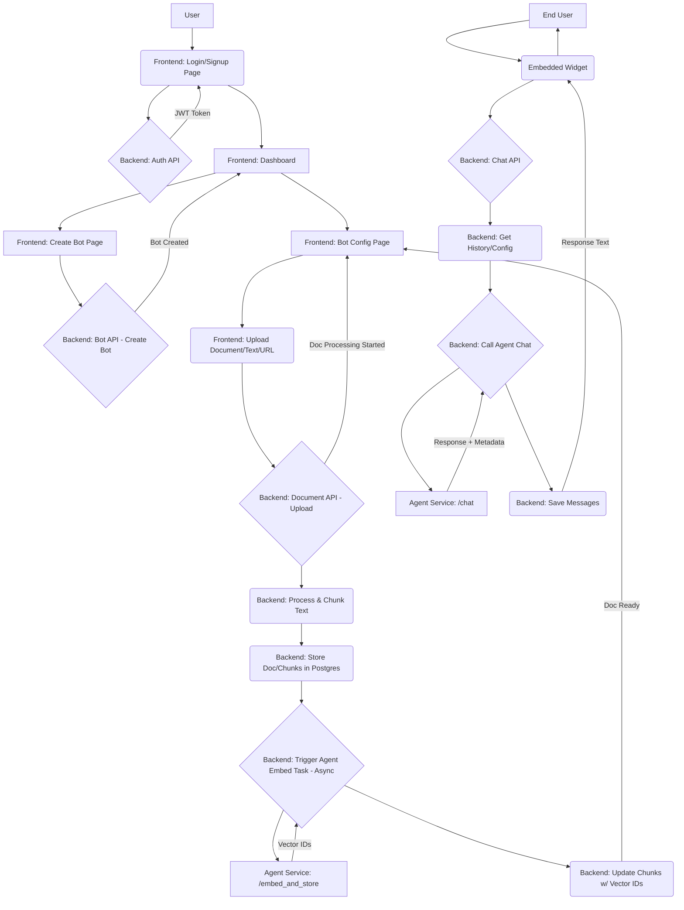

```mermaid
graph TD
    A[User] --> B(Frontend: Login/Signup Page);
    B --> C{Backend: Auth API};
    C -- JWT Token --> B;
    B --> D[Frontend: Dashboard];
    D --> E[Frontend: Create Bot Page];
    E --> F{Backend: Bot API - Create Bot};
    F -- Bot Created --> D;
    D --> G[Frontend: Bot Config Page];
    G --> H(Frontend: Upload Document/Text/URL);
    H --> I{Backend: Document API - Upload};
    I -- Doc Processing Started --> G;
    I --> J(Backend: Process & Chunk Text);
    J --> K(Backend: Store Doc/Chunks in Postgres);
    K --> L{Backend: Trigger Agent Embed Task - Async};
    L --> M[Agent Service: /embed_and_store];
    M -- Vector IDs --> L;
    L --> N(Backend: Update Chunks w/ Vector IDs);
    N -- Doc Ready --> G; 
    O[End User] --> P(Embedded Widget);
    P --> Q{Backend: Chat API};
    Q --> R(Backend: Get History/Config);
    R --> S{Backend: Call Agent Chat};
    S --> T[Agent Service: /chat];
    T -- Response + Metadata --> S;
    S --> U(Backend: Save Messages);
    U -- Response Text --> P;
    P --> O;
``` 